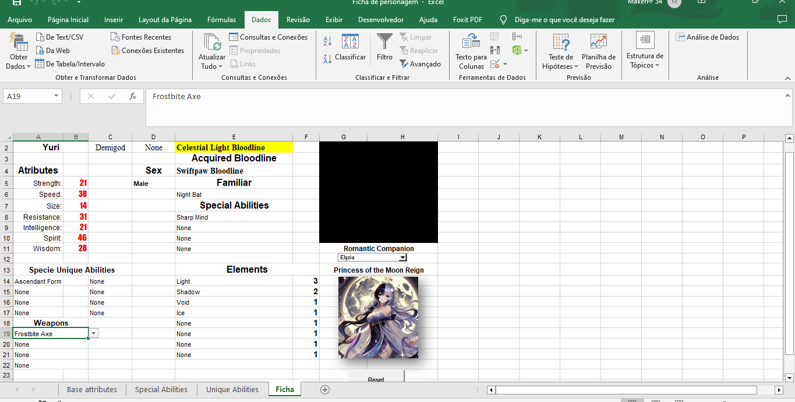

# Sistema de Criação de Personagem em Excel com VBA

## Descrição
Este projeto é um sistema dinâmico de criação de personagens desenvolvido em Excel, utilizando **VBA (Visual Basic for Applications)**. Ele permite que o usuário escolha raças, 
habilidades, linhagens sanguineas, etc... com atributos que são atualizados automaticamente com base nas seleções feitas.

## Funcionalidades Principais
- **Customização de Personagem**: Escolha a espécie do personagem e customize diversas opções disponiveis.
- **Habilidades Específicas de Espécie**: O usuário pode selecionar habilidades únicas para cada espécie (as opções do menu de habilidades variam conforme a espécie), e ver como elas afetam os atributos do personagem.
- **Afinidades Elementais**: A partir das seleções das variaveis(Habilidades, Bloodlines, Armas), as afinidades elementais do personagem são automaticamente atribuídas.
- **Botão de Reset**: Um botão de reset foi implementado para limpar a ficha do personagem e redefinir todas as seleções.

## Estrutura do Projeto
1. **Base Attributes**: Planilha com as raças e seus atributos base. Essa planilha é referenciada na escolha de raça através de funções PROCV.
2. **Special Abilities**: Planilha que armazena todas as variaveis que alteram os atributos, ela é referenciada em todos os atributos, foram criados intervalos nomeados para cada coluna e utilizado a Função SOMASE para realizar a soma dos incrimetos de cada variável.
3. **Unique Abilities**: Planilha criada para relacionar a espécie com suas habilidades unicas, permitindo assim que quando alterado a espécie as habilidades sejam unicas para aquela espécie.
4. **Ficha**: Planilha principal do projeto, onde a customização é realizada.

## Tecnologias Utilizadas
- **Excel**: Planilhas para organizar as seleções, validação de dados e os cálculos.
- **VBA (Visual Basic for Applications)**: Para automatizar atualizações de elementos com base nas seleções feitas pelo usuário.

## Como Utilizar
1. **Baixe o arquivo** clicando [aqui](./Ficha%20de%20personagem.xlsm).
2. Abra o arquivo no **Microsoft Excel** com as macros habilitadas.
3. Selecione as opções de espécie, bloodlines e habilidades.
4. Veja os atributos do personagem sendo atualizados automaticamente.
5. Use o botão de reset para limpar todas as seleções e começar um novo personagem.

## Capturas de Tela
  
*Figura 1: Exemplo de customização.*
